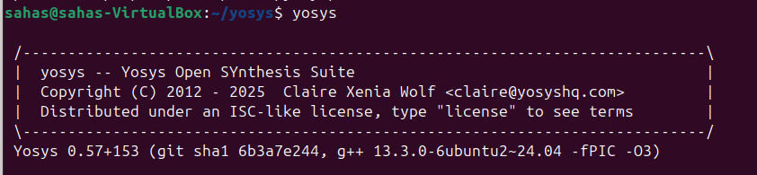

This repository provides the setup instructions for installing Yosys, Icarus Verilog (Iverilog), and GTKWave on Ubuntu Linux. These tools are commonly used for FPGA synthesis, simulation, and waveform viewing.

## Yosys Installation

Yosys is a framework for digital synthesis and is used for FPGA synthesis.

```bash
$ sudo apt-get update
$ git clone https://github.com/YosysHQ/yosys.git
$ cd yosys
$ sudo apt install make               # If make is not installed
$ sudo apt-get install build-essential clang bison flex \
    libreadline-dev gawk tcl-dev libffi-dev git \
    graphviz xdot pkg-config python3 libboost-system-dev \
    libboost-python-dev libboost-filesystem-dev zlib1g-dev
$ make config-gcc
# Yosys build depends on a Git submodule called abc, which hasn't been initialized yet. You need to run the following command before running make
$ git submodule update --init --recursive
$ make 
$ sudo make install
```

### Step 2: Verify Yosys Installation



If Yosys is correctly installed, it will display the version information.

## Iverilog Installation

Iverilog is a Verilog simulator and is widely used for simulating Verilog designs.

### Step 1: Install Iverilog

To install Iverilog on Ubuntu, run the following command:

```bash
$ sudo apt-get update
$ sudo apt install iverilog
```

### Step 2: Verify Iverilog Installation

Once installed, verify the installation by running:


It will print the Iverilog version to confirm that the installation was successful.


## GTKWave Installation

GTKWave is a waveform viewer used to visualize the simulation results from Iverilog or other simulators.

### Step 1: Install GTKWave

Install GTKWave by running the following command:

```bash
$ sudo apt-get update
$ sudo apt install gtkwave
```

### Step 2: Verify GTKWave Installation

Verify that GTKWave is installed


---
